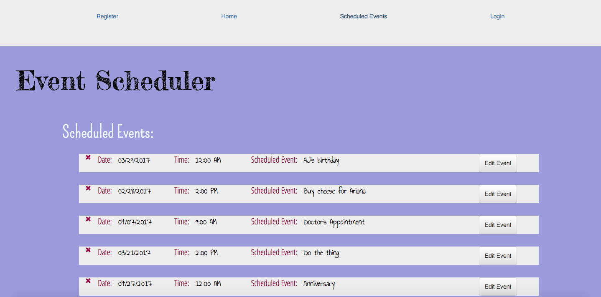

#Event Scheduler

##Link to Event Scheduler

https://eventschedulerapp.herokuapp.com/events

##Description

Event Scheduler is a personal calendar app that you can use to keep track of appointments, events, interviews, birthdays, etc.

##Technologies Used
- HTML
- JSX
- CSS
- JavaScript
- React
- React Router DOM
- Bootstrap
- Express.js
- PostgreSQL
- Sequelize
- Passport
- Bcryptjs
- Express-Session
- Nodemon
- Github

##Complications/Future Improvements

Figuring out how the data flow between Express and React worked was a bit of a challenge at first. 

Future versions of this app will show weather forecast data for upcoming events. 

I would also like to add the ability to access map data for the event's location so users can find the location they need to get to more easily.

##Contributers

Impossible to list everyone who helped with both moral and practical support, but Jennifer Kaplan helped keep me on track. Kate and Arianan helped solve a problem I was stuck on an entire day. Vince inspired this whole React-Express endeavor by breaking down the process in an easy to understand way.

